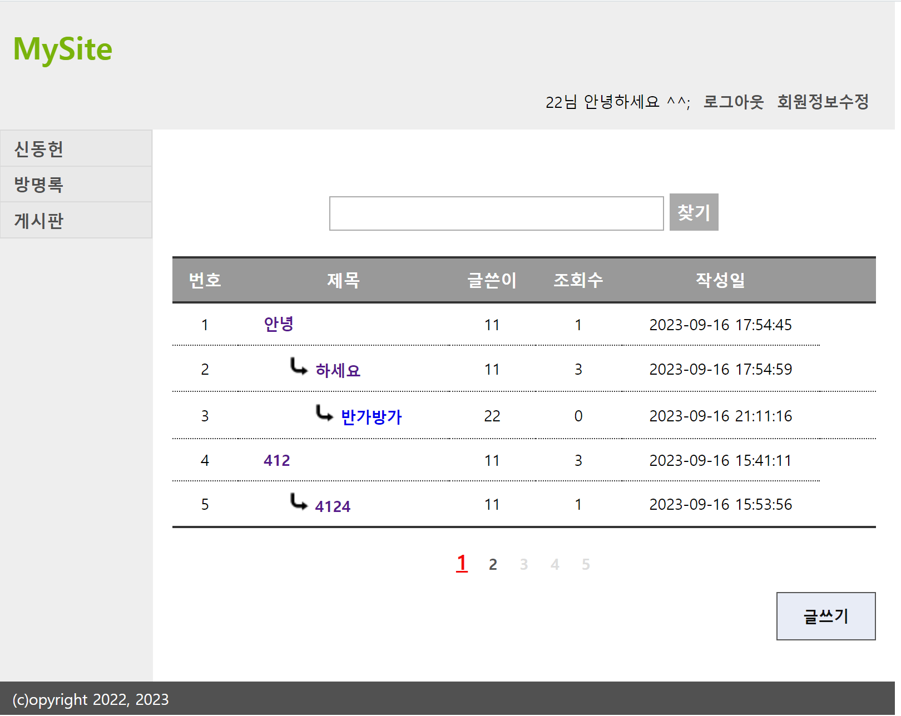
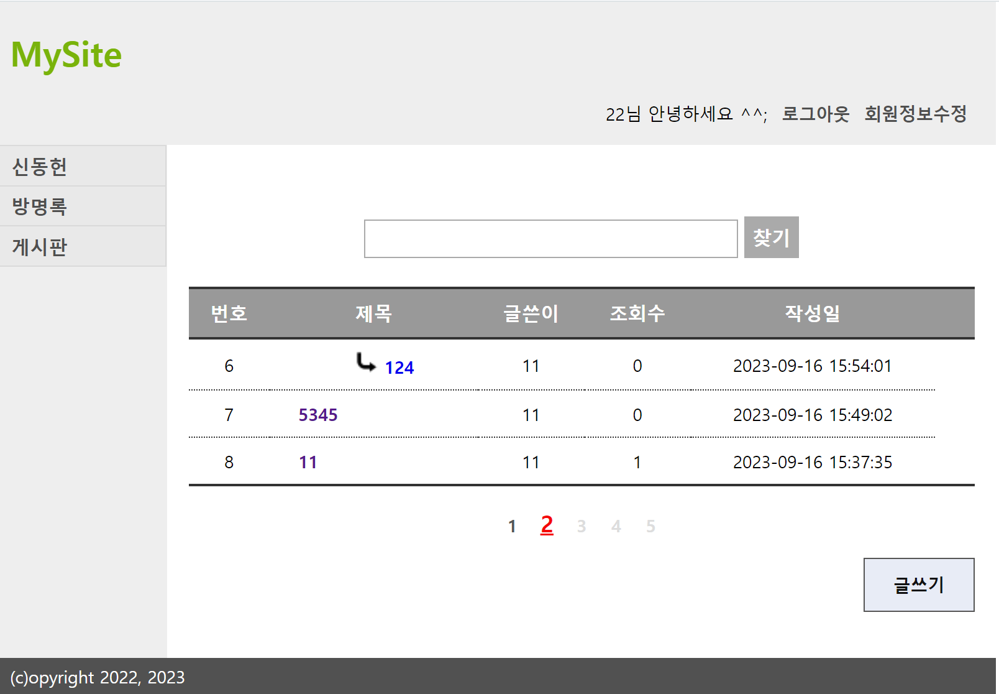
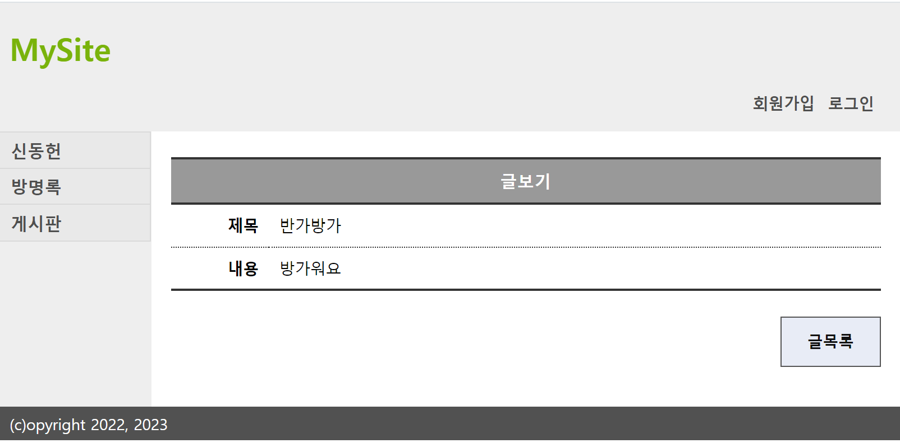
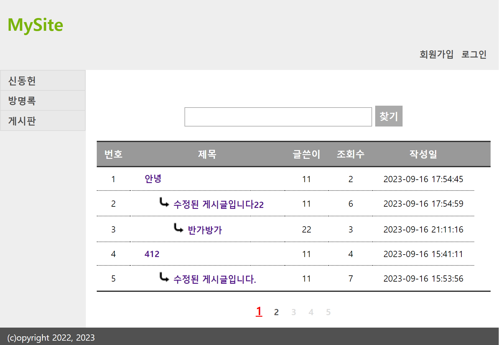
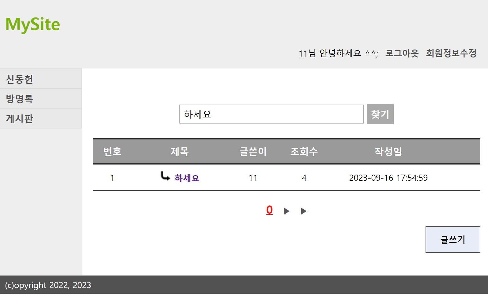
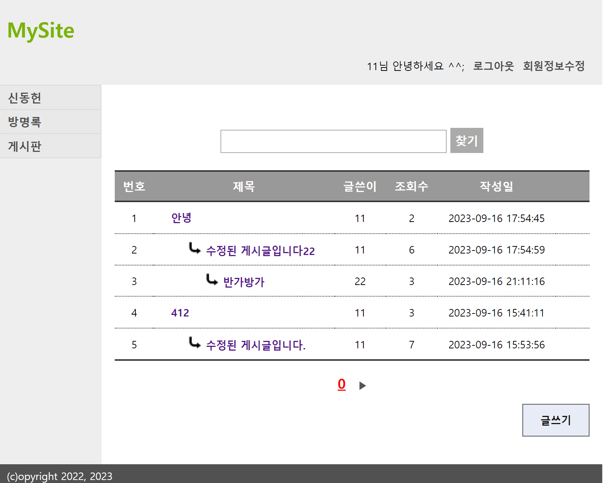
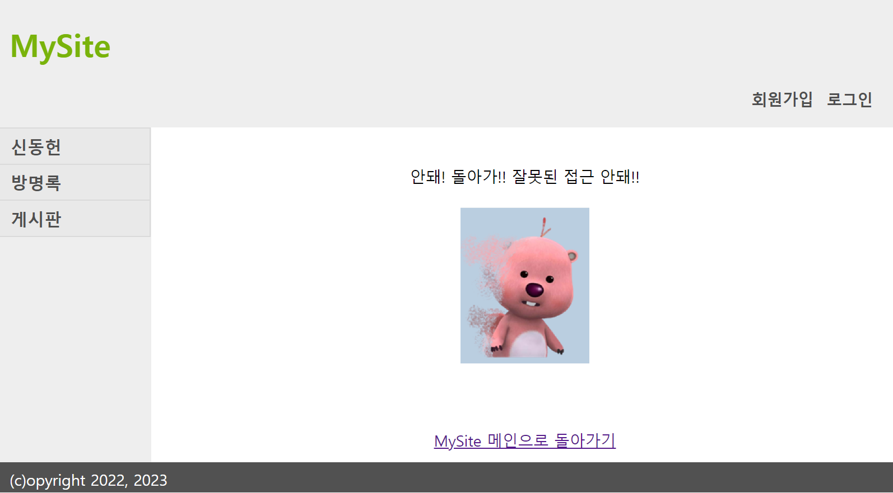

# mysite 신동헌

## jblog03 과제 

* 월, 화) Gallery, jblog03
* 갤러리는  file upload 관련
* jblog03은 평가 과제인데, mysite03처럼, 네이버 블로그 만든다고 생각하면 된다.
* 14일까지


* SpringMVC 평가과제
* 블로그 시스템
* 블로그 관리자 / 블로그 사용자 기능구현
* 결과물 - JBlog 프로젝트 제출

### 기능
* 회원가입
* 회원가입을 하면 해당 사용자의 블로그가 자동 생성
* 생성된 블로그는 블로그 주인뿐만 아니라 인증없는 외부 접근이 가능.
* 인증된 사용자가 자신의 블로그의 블로그에 접근하면 관리메뉴가 나타나고 관리 메뉴를 통해 블로그 관리페이지에 접근할 수 있다.
* 관리 페이지에서는 여러 기능 설정할 수 잇다
* 


## 게시물 과제 Done


✅ MVC 적용 : 20점

    - 적절한 Model 사용( DAO, VO ) : 5점
    - 페이지 이동의 올바른 사용 ( redirection, fowarding ) : 5점
    - Action 클래스 구현 여부 : 5점
    - 페이지 링크, 폼 포스팅의 적절한 URL 사용 : 5점


✅ MVC 적용 (20점)      
✅ 게시물 입력 (10)    
✅ 게시물 리스트 (10)     
✅ 게시물 삭제 (10)     
✅ 게시물 보기 (5)    
✅ 게시물 수정 (5)     
✅ 조회수( 10 )    
✅ 답글( 10 )    
✅ 리스트에서 게시물 검색 기능 (선택 )    
✅ 페이징 처리 ( 10 )   
✅ 예외발생 ( 건당 -5 )


✅로그인 안하면 게시판 글쓰기 버튼 없어야 한다.   
✅ 로그인 하고 게시판의 자기 글에만 쓰레기통 버튼 있어야 한다.    
✅ 페이징 <1 2 3 4 5>


# 결과물

### 리스트, 글쓰기, 조회수


### 페이지


### 비로그인 글보기


### 비로그인 글쓰기, 댓글 제한


### 검색


### 수정


### 예외처리



## 최종 과제
```markdown

- no: 게시글 번호
- title: 게시글 제목
- contents: 게시글 내용
- hit: 조회수
- regDate: 등록일자
- groupNo: 게시글 그룹 번호
- orderNo: 게시글 순서
- depth: 게시글 깊이

각 멤버 변수는 getter와 setter 메서드를 가지고 있습니다.   
이 클래스는 toString() 메서드를 오버라이딩하여 객체의 정보를 문자열로 반환합니다.

```


## MVC(Model-View-Controller) 패턴을 적용.

**Action 및 ActionFactory 구현**
Action: 각각의 요청에 대한 처리를 담당하는 클래스입니다.   
로그인 여부, 권한 등을 확인하고, 해당 요청에 맞는 작업을 수행합니다.   

**ActionFactory**: 클라이언트의 요청에 따라 적절한 Action 객체를 생성하여 반환하는 클래스입니다.   

### 로그인 여부에 따른 글쓰기 버튼 표시
View에서 로그인 여부를 확인하여, 로그인하지 않은 경우 글쓰기 버튼을 표시하지 않도록 if문을 사용합니다.   
추가로 다른 버튼 하나를 생성하여, 비로그인 상태에서도 이용할 수 있음   

### 쓰레기통 버튼 표시 
View에서 각 게시물의 작성자와 현재 사용자 정보를 비교하여, 자신의 글에만 쓰레기통 버튼이 표시되도록 처리합니다.    


### 입력, 리스트, 삭제 기능 구현
**입력:** 새글 작성과 댓글 달기 두 가지 경우로 나뉩니다.   
**새글 작성:** 리스트 > 글쓰기 폼 > 새글 순서로 진행됩니다.   
**댓글 달기:** 리스트 > 글보기 > 글쓰기 폼 > 댓글 순서로 진행됩니다.      
**리스트:** 계층형 게시판으로서 데이터베이스에서 `SELECT * FROM board ORDER BY group_no DESC, u_no ASC`와 같은 SQL 문으로 정렬된 결과를 가져옵니다.
**삭제:** 선택된 게시물의 정보를 받아와 해당 게시물을 삭제합니다.     

### 조회수 및 페이징 처리 
**조회수:** 각 게시물마다 조회수 정보가 있어야 합니다. 사용자가 해당 게시물을 열면 조회수가 1증가하도록 처리합니다.
**페이징 처리:**      
startPage(첫 페이지 번호), endPage(마지막 페이지 번호),   
currentPage(현재 페이지 번호), nextPage(다음 페이지 번호),    
prevPage(이전 페이지 번호) 등의 변수를 Controller에서 계산하여 JSP로 전달합니다.   

(게시판)   
새 글인 경우,  group_no 는 순차적으로 MAX(group_no) + 1 이 되고    
order_no 는 1, depth는 0 가 된다.

위와 같은 방식으로 MVC 패턴과 계층형 게시판 CRUD(Create-Read-Update-Delete) 기능 및 페이징 처리를 구현할 수 있습니다.    


---

### [controller](https://github.com/githubmendong/mysite/tree/main/mysite02/src/main/java/com/poscodx/mysite/controller)
 * [BoardController.java](https://github.com/githubmendong/mysite/blob/main/mysite02/src/main/java/com/poscodx/mysite/controller/BoardController.java)
 * [GuestbookController.java](https://github.com/githubmendong/mysite/blob/main/mysite02/src/main/java/com/poscodx/mysite/controller/GuestbookController.java)
 * [MainController.java](https://github.com/githubmendong/mysite/blob/main/mysite02/src/main/java/com/poscodx/mysite/controller/MainController.java)
 * [UserController.java](https://github.com/githubmendong/mysite/blob/main/mysite02/src/main/java/com/poscodx/mysite/controller/FUserController.java)

### [dao](dao)   
* [BoardDao.java]
* [GuestBookDao.java](GuestBookDao.java)
* [UserDao.java](UserDao.java)

### [vo]( dao)
* [BoardVo.java]()
* [PaginationVo.java]()
* [GuestBookVo.java](GuestBookVo.java)
* [UserVo.java](UserVo.java)

### [board]
* [BoardActionFactory.java]
* [BoardDeleteAction.java]
* [BoardListAction.java](mysite02%2Fsrc%2Fmain%2Fjava%2Fcom%2Fposcodx%2Fmysite%2Fweb%2Fmvc%2Fboard%2FBoardListAction.java)
* [BoardRelpyFromAction.java](mysite02%2Fsrc%2Fmain%2Fjava%2Fcom%2Fposcodx%2Fmysite%2Fweb%2Fmvc%2Fboard%2FBoardRelpyFromAction.java)
* [BoardReplyAction.java](mysite02%2Fsrc%2Fmain%2Fjava%2Fcom%2Fposcodx%2Fmysite%2Fweb%2Fmvc%2Fboard%2FBoardReplyAction.java)
* [BoardViewAction.java](mysite02%2Fsrc%2Fmain%2Fjava%2Fcom%2Fposcodx%2Fmysite%2Fweb%2Fmvc%2Fboard%2FBoardViewAction.java)
* [BoardWriteAction.java](mysite02%2Fsrc%2Fmain%2Fjava%2Fcom%2Fposcodx%2Fmysite%2Fweb%2Fmvc%2Fboard%2FBoardWriteAction.java)
* [BoardWriteFromAction.java](mysite02%2Fsrc%2Fmain%2Fjava%2Fcom%2Fposcodx%2Fmysite%2Fweb%2Fmvc%2Fboard%2FBoardWriteFromAction.java)
* [ModifyAction.java](mysite02%2Fsrc%2Fmain%2Fjava%2Fcom%2Fposcodx%2Fmysite%2Fweb%2Fmvc%2Fboard%2FModifyAction.java)
* [ModifyFormAction.java](mysite02%2Fsrc%2Fmain%2Fjava%2Fcom%2Fposcodx%2Fmysite%2Fweb%2Fmvc%2Fboard%2FModifyFormAction.java)
* [PagingAction.java](mysite02%2Fsrc%2Fmain%2Fjava%2Fcom%2Fposcodx%2Fmysite%2Fweb%2Fmvc%2Fboard%2FPagingAction.java)

### [controller]()
* [AddAction.java]( AddAction.java)
* [CookieServlet.java]( CookieServlet.java)
* [DeleteAction.java](   DeleteAction.java)
* [DeleteFormAction.java](   DeleteFormAction.java)
* [GuestbookActionFactory.java](   GuestbookActionFactory.java)
* [ListAction.java](   ListAction.java)

### [main](  main)
* [MainAction.java](  main%2FMainAction.java)
* [MainActionFactory.java](  main%2FMainActionFactory.java)

### [user](  user)
* [JoinAction.java](   JoinAction.java)
* [JoinFormAction.java](   JoinFormAction.java)
* [JoinSuccessAction.java](   JoinSuccessAction.java)
* [LoginAction.java](   LoginAction.java)
* [LoginformAction.java](   LoginformAction.java)
* [LogoutAction.java](   LogoutAction.java)
* [UpdateAction.java](   UpdateAction.java)
* [UpdateformAction.java](   UpdateformAction.java)
* [UserActionFactory.java](  UserActionFactory.java)

### [utils]( utils)
* [WebUtil.java](WebUtil.java)

### [mvc](mvc)
* [Action.java](Action.java)
* [ActionFactory.java](ActionFactory.java)   

### [EncodingFilter.java](EncodingFilter.java)


---

### [board]
* [list.jsp](mysite02%2Fsrc%2Fmain%2Fwebapp%2FWEB-INF%2Fviews%2Fboard%2Flist.jsp)
* [modify.jsp](mysite02%2Fsrc%2Fmain%2Fwebapp%2FWEB-INF%2Fviews%2Fboard%2Fmodify.jsp)
* [reply.jsp](mysite02%2Fsrc%2Fmain%2Fwebapp%2FWEB-INF%2Fviews%2Fboard%2Freply.jsp)
* [view.jsp](mysite02%2Fsrc%2Fmain%2Fwebapp%2FWEB-INF%2Fviews%2Fboard%2Fview.jsp)
* [write.jsp](mysite02%2Fsrc%2Fmain%2Fwebapp%2FWEB-INF%2Fviews%2Fboard%2Fwrite.jsp)

### [views]( views)   
* [board](  board)
* [list.jsp](   list.jsp)
* [modify.jsp](   modify.jsp)
* [view.jsp](   view.jsp)
* [write.jsp](   write.jsp)

### [guestbook](  guestbook)
* [deleteform.jsp](  deleteform.jsp)
* [index.jsp](  index.jsp)
* [list.jsp](  list.jsp)

### [includes](  includes)
* [footer.jsp]( footer.jsp)
* [header.jsp](  header.jsp)
* [navigation.jsp](navigation.jsp)

### [main](  main)
* [index.jsp](index.jsp)

### [user](  user)
* [joinform.jsp](  joinform.jsp)
* [joinsuccess.html](  joinsuccess.html)
* [joinsuccess.jsp](  joinsuccess.jsp)
* [loginform.jsp](  loginform.jsp)
* [updateform.jsp](  updateform.jsp)


### [web.xml]( web.xml)
### [pom.xml](pom.xml)